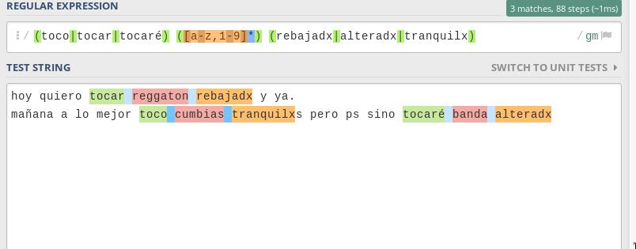

# Tinalla

## *T*his *I*s *N*ot *A*nother *L*ivecoding *L*anguage

Livecoding framework for text parsing and OSC messaging

## about

This was made, thinking of different ways of creating languages, parsing any 



## docs

```
server(/ip/, /port/)

parse(/regex rule/, /oscdir/, /parsing rule/)

range(/start/, /end/,()=>{
  parse(/regex rule/, /oscdir/, /parsing rule/)
  server(/ip/, /port/).parse(/regex rule/, /oscdir/, /parsing rule/)
})

load(/filename/)

```


