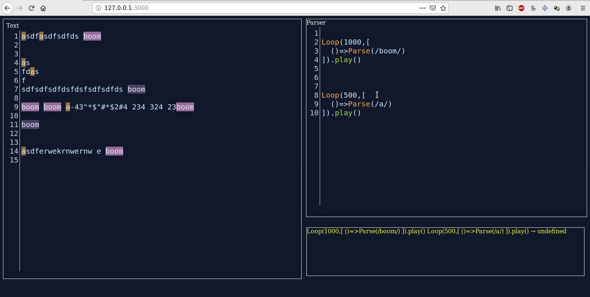

# Tinalla

## *T*his *I*s *N*ot *A*nother *L*ivecoding *L*anguage

Livecoding framework for text parsing and OSC messaging.

## about

This was made, thinking of different ways of creating languages, parsing and looping, thinking of different ways of programming and an atempt of replicating this.




## documentation

__Instalation__


For installation it's necesary to have installed [node js](https://nodejs.org)

```
git clone https://github.com/axelkramble/tinalla.git
npm install
```

For running the server in [http://127.0.0.1:3000](http://127.0.0.1:3000)

```
npm run start
```

__Usage__

*Regular Expresions*
Regular expresion are patterns to filter data with certain structure, for example, an email usually looks like this: `someone@mail.com`, the mail strictly has an `@`, has a hosting and an alias, there should not be spaces or weird characters, we could describe the regex for filtering emails as `[a-zA-Z0-9-_]+@[a-zA-Z0-9-_]+\.com` where `a-z` means any

there are two editor, a text editor where it's possible to write fluid text and the parsing editor, where the parsing rules are written.


*Parsing editor*
* `Shift-Ctrl-Enter` : Executes all the lines.
* `Ctrl-Enter` : Executes the current line / current selection.
* `Tab` : Focus the text editor.

*Text editor*
* `Shift-Ctrl-Enter` : Executes the regex rules in all the text.
* `Ctrl-Enter` : Executes the regex rules in the current line / current selection
* `Tab` : Focus the parsing editor.
* onchange : Executes the regex rules if these are registered with `onchange: true`

**

__Documentation__

For parsing rules and loop implementation:

[function docs](./docs/functions.md)

## issues or improvements

I'd be glad if you found an issue, you can always put an issue in github or send me a email to rexmalebka@krutt.org.
